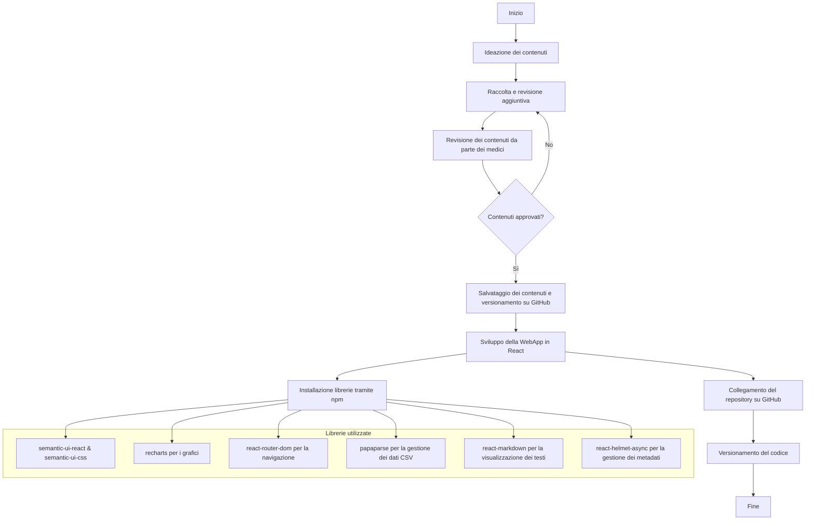

{width=100px height=100px}

# Health Dashboard! Una WebApp per tenere sotto controllo il tuo benessere

[Link alla WebApp (in locale)](http://localhost:5174/)

[Link alla repository del progetto](https://github.com/mauritiuss/health-dashboard)

## Introduzione

Questo progetto è stato sviluppato da un’azienda specializzata nella produzione di dispositivi smart per il monitoraggio della salute, come smartwatch e braccialetti fitness. L’obiettivo è creare un report personalizzato e interattivo, facilmente accessibile, coinvolgente e ricco di informazioni. Questo report permette all’utente di visualizzare in modo chiaro e intuitivo i dati rilevati dal proprio dispositivo smart, come il numero di passi giornalieri, la frequenza cardiaca, le ore di sonno e la temperatura corporea misurata dal polso.

L’azienda richiedeva che il prodotto editoriale digitale fosse di facile comprensione per gli utenti, facilmente accessibile, coinvolgente e informativo. Per soddisfare queste esigenze, è stata scelta la soluzione di una WebApp, in quanto offre numerosi vantaggi: è accessibile da qualsiasi dispositivo con una connessione Internet, non richiede installazione, garantisce aggiornamenti immediati e consente un’esperienza interattiva e dinamica, adattandosi a diverse dimensioni di schermo.

Per l’acquisizione dei contenuti sono state utilizzate intelligenze artificiali, come GPT-4, per reperire documenti scientifici, con integrazioni e revisioni manuali da parte di medici esperti, ove necessario. Il risultato finale risponde pienamente alle richieste dell’azienda, offrendo un accesso semplice e un contenuto interattivo e accurato.

## Ideazione

### Tema
Il tema richiesto dall’azienda riguarda il monitoraggio della salute degli utenti.

Tenere sotto controllo parametri come il numero di passi giornalieri, la frequenza cardiaca, le ore di sonno e la temperatura corporea è fondamentale per mantenere uno stile di vita sano. Tuttavia, questi dati sono spesso difficili da leggere e interpretare. Per questo motivo, la WebApp è stata progettata per presentare le informazioni in modo chiaro e accessibile, attraverso grafici intuitivi e spiegazioni dettagliate dei dati raccolti.

### Destinatari

I seguenti destinatari sono stati creati adottando la tecnica delle personas:

1. **Andrea, 24 anni, studente universitario**
   - **Background**: Studia Ingegneria Informatica, appassionato di tecnologia e dispositivi smart. Fa sport occasionalmente e usa uno smartwatch per monitorare la sua attività fisica.
   - **Obiettivi**: Tenere sotto controllo i suoi parametri vitali e migliorare il proprio stile di vita.
   - **Bisogni**: Dati chiari e facili da consultare, con grafici intuitivi e informazioni dettagliate sui parametri rilevati.
   - **Scenario d'uso**: Accede alla WebApp per controllare i passi giornalieri. Consulta le spiegazioni dei dati per capire come migliorare la sua performance fisica.

2. **Marta, 30 anni, giovane professionista**
   - **Background**: Lavora in smart working come project manager, ha una vita sedentaria e vuole prendersi più cura della propria salute. Ha un fitness tracker per monitorare i suoi parametri.
   - **Obiettivi**: Mantenere uno stile di vita sano nonostante le molte ore passate davanti al computer.
   - **Bisogni**: Un’interfaccia semplice e accessibile per monitorare i dati e controllare le proprie abitudini.
   - **Scenario d'uso**: Consulta la WebApp ogni settimana per verificare i passi fatti, le ore di sonno e la frequenza cardiaca, cercando di migliorare la propria routine.

3. **Luigi, 45 anni, impiegato d’ufficio**
   - **Background**: Lavora a tempo pieno in un’azienda, passa molte ore seduto e ha iniziato a monitorare la sua salute per prevenire problemi cardiovascolari.
   - **Obiettivi**: Tenere sotto controllo i parametri vitali per evitare rischi per la salute.
   - **Bisogni**: Dati facilmente interpretabili e spiegazioni chiare sui valori rilevati, magari con avvisi in caso di anomalie.
   - **Scenario d'uso**: Accede alla WebApp per monitorare la frequenza cardiaca e la temperatura corporea, verificando se i parametri sono nella norma.

4. **Sara, 27 anni, personal trainer**
   - **Background**: Lavora nel settore fitness, usa dispositivi smart per monitorare la propria attività fisica.
   - **Obiettivi**: Avere un quadro chiaro dei dati di attività fisica.
   - **Bisogni**: Grafici dettagliati che aiutino a visualizzare progressi e criticità.
   - **Scenario d'uso**: Accede alla WebApp per monitorare la frequenza cardiaca e la temperatura corporea, verificando se i parametri sono nella norma.

5. **Francesco, 50 anni, paziente con patologie croniche**
   - **Background**: Ha problemi di ipertensione e monitora la propria salute con uno smartwatch medico. È poco esperto di tecnologia.
   - **Obiettivi**: Monitorare parametri come la frequenza cardiaca e la temperatura corporea, evitando situazioni di rischio.
   - **Bisogni**: Interfaccia semplice e spiegazioni chiare sui dati, con indicazioni su quando è necessario consultare un medico.
   - **Scenario d'uso**:  Utilizza la WebApp per controllare i parametri vitali e si sente rassicurato dalla possibilità di accedere facilmente ai suoi dati.

### Modello di fruizione
L’azienda richiede un prodotto editoriale digitale interattivo che crei un report personalizzato, chiaro e coinvolgente. Per soddisfare queste esigenze, è stata scelta una WebApp perché è accessibile da qualsiasi dispositivo con una connessione Internet, senza bisogno di installare programmi aggiuntivi.

Questa soluzione garantisce una fruibilità ottimale su una vasta gamma di dispositivi (smartphone, tablet, PC) e una maggiore adattabilità rispetto a formati statici come PDF o ePub, che possono richiedere applicazioni esterne o non adattarsi perfettamente agli schermi mobili.

Per rendere i dati facili da consultare, abbiamo scelto un modello visivo e interattivo. La WebApp mostra i parametri rilevati (come passi giornalieri, frequenza cardiaca, ore di sonno e temperatura corporea) attraverso grafici chiari e spiegazioni semplici. Questo aiuta l’utente a interpretare facilmente le informazioni sulla propria salute.

L’innovazione di questa WebApp sta nella combinazione di contenuti personalizzati e un’interfaccia interattiva. I dati non solo vengono mostrati, ma anche spiegati con suggerimenti pratici, aiutando l’utente a comprendere meglio il proprio stato di salute. La possibilità di visualizzare grafici dinamici e personalizzare le informazioni rende l’esperienza più coinvolgente e utile.

### Canali di distribuzione
Per distribuire il prodotto editoriale digitale, si prevede l'utilizzo di:

- **Web**: La WebApp sarà il canale principale, accessibile da qualsiasi browser senza bisogno di installare applicazioni aggiuntive.

L’identità visuale seguirà uno stile moderno, chiaro e professionale, con un design minimale che favorisca la leggibilità e l’usabilità. 
Per lo sviluppo grafico, ci siamo affidati a **Semantic UI**, una libreria front-end che offre componenti predefiniti eleganti e facilmente personalizzabili. Questo ha permesso di mantenere una coerenza visiva, con elementi ben strutturati e intuitivi.
Per la rappresentazione dei dati, abbiamo scelto la libreria **Recharts**, che consente di creare grafici dinamici e interattivi (a barre, linee, torte) offrendo una visualizzazione immediata e comprensibile dei parametri monitorati.

Inoltre:
- **Colori**: Palette sobria con tonalità neutre e accenti di colore per evidenziare dati importanti (es.: verde per valori nella norma, rosso per anomalie).
- **Icone**: Anche per le icone, abbiamo utilizzato Semantic UI, garantendo uno stile coerente e riconoscibile in tutta la WebApp.

L’obiettivo è bilanciare innovazione e familiarità:
- **Adesione a modelli conosciuti**: La struttura della WebApp richiama dashboard di monitoraggio già note, facilitando la navigazione intuitiva.
- **Innovazione**: La personalizzazione avanzata dei report e la visualizzazione dinamica dei dati tramite grafici interattivi rendono l’esperienza più coinvolgente rispetto ai report tradizionali statici (come PDF).

## Processo di Produzione

### Acquisizione dei contenuti

L'acquisizione dei contenuti è avvenuta attraverso un approccio misto.

La fase iniziale di generazione del testo e ricerca delle fonti è stata svolta tramite l’intelligenza artificiale, utilizzando **ChatGPT basato sul modello GPT-4**. Questo modello avanzato, sviluppato da OpenAI, è stato scelto per la sua capacità di produrre testi coerenti, pertinenti e ben strutturati.

Successivamente, il contenuto è stato sottoposto a una revisione manuale da parte di esperti medici, con l’obiettivo di garantire un’elevata qualità, integrare eventuali informazioni mancanti e verificare l’accuratezza delle fonti utilizzate.

Quando le fonti originali si sono rivelate insufficienti o poco precise, sono state selezionate ulteriori risorse affidabili per completare il processo di acquisizione dei contenuti in modo rigoroso e attendibile.

Spiegazione del modello adottato:
- **GPT-4**: Si tratta di un modello di linguaggio di ultima generazione sviluppato da OpenAI, noto per la sua capacità di comprendere il contesto e produrre risposte dettagliate e accurate. È stato scelto per la sua particolare efficacia nella generazione di testi complessi, supportando attività come la scrittura creativa, la revisione e l’elaborazione di contenuti tecnici. Questa tecnologia si è rivelata fondamentale nella fase iniziale di raccolta e strutturazione delle informazioni.

L’approccio combinato tra l’utilizzo dell’intelligenza artificiale per il reperimento delle fonti e la revisione da parte di medici esperti ha permesso di offrire agli utenti informazioni accurate, complete e di alto valore.

### Gestione documentale
Il flusso di gestione documentale si compone delle seguenti fasi:
1. **Ideazione**: dentificazione dei contenuti più comuni e significativi in base alle esigenze emerse dalle *personas* definite. Questa fase ha permesso di stabilire quali dati e informazioni sarebbero stati più utili e rilevanti per gli utenti finali.
2. **Acquisizione dei contenuti**: Raccolta delle informazioni tramite intelligenza artificiale, utilizzando **ChatGPT basato sul modello GPT-4**. L’AI è stata impiegata per reperire studi scientifici e dati utili riguardanti i parametri di monitoraggio della salute, come passi giornalieri, frequenza cardiaca, ore di sonno e temperatura corporea.
3. **Revisione dei contenuti**: Le informazioni raccolte tramite l’AI sono state sottoposte a una revisione manuale da parte di medici esperti. Questo passaggio ha garantito l’accuratezza, la coerenza e l’affidabilità dei dati, integrando o correggendo eventuali inesattezze fornite dall’intelligenza artificiale.
4. **Sviluppo della WebApp**: Creazione della WebApp utilizzando **React**. Questa tecnologia è stata scelta per la sua flessibilità, la capacità di creare interfacce dinamiche e l’ampio supporto della community di sviluppatori.
5. **Gestione del versionamento**: Collegamento del repository del progetto a **GitHub**, in modo da gestire in modo efficiente il versionamento del codice e facilitare la collaborazione e il monitoraggio delle modifiche.
6. **Implementazione delle librerie**: Installazione e utilizzo delle librerie necessarie tramite **npm**, per garantire una corretta scrittura del codice e un’interfaccia intuitiva e responsive. Le librerie adottate sono state:
   - **semantic-ui-react** e **semantic-ui-cs** per la progettazione dell’interfaccia grafica.
   - **Vite** per la creazione rapida del progetto React.
   - **papaparse** per la gestione e l’elaborazione dei file CSV.
   - **react-router-dom** per la navigazione tra le diverse pagine della WebApp.
   - **recharts** per la visualizzazione dei dati attraverso grafici chiari e interattivi.
   - **react-markdown** per il rendering della bibliografia in formato markdown.
   - **react-helmet-async** per gestire in modo dinamico i metadati delle pagine, come titolo, descrizione e parole chiave.
7. **Salvataggio e aggiornamento**: Ogni modifica e aggiornamento dei contenuti e del codice è stato salvato e versionato tramite GitHub, garantendo una gestione ordinata e tracciabile dello sviluppo del progetto.

### Tecnologie adottate
Le tecnologie utilizzate sono state selezionate per garantire l'efficacia e la qualità delle diverse fasi del progetto.
Le tecnologie utilizzate sono state selezionate per garantire l'efficacia e la qualità delle diverse fasi del progetto, offrendo strumenti adeguati sia per la creazione dei contenuti che per la loro gestione e distribuzione. Ecco una panoramica delle tecnologie principali e del loro contributo:

| Tecnologia  | Contributo principale |
|-------------|------------------------|
| **React** | **Sviluppo della WebApp.** React è stato scelto per la sua efficienza nella creazione di interfacce dinamiche e responsive. Grazie alla sua architettura basata su componenti, ha permesso di costruire un’app modulare e facilmente manutenibile. |
| **GitHub**    | **Gestione del repository e del versioning.** GitHub è stato utilizzato per il controllo della versione del progetto, consentendo una gestione efficace del codice e la collaborazione tramite commit, pull request e issue tracking. |
| **semantic-ui-react**  | **Realizzazione dell’interfaccia grafica.** Questa libreria è stata impiegata per creare componenti UI moderni e responsive, garantendo coerenza stilistica e facilità d’uso. |
| **semantic-ui-css** | **Stile visivo della WebApp** Insieme a semantic-ui-react, questa libreria ha fornito un set di regole CSS predefinite per ottenere un design pulito e professionale senza necessità di personalizzazioni estese.. |
| **Recharts**   | **Creazione di grafici interattivi.** Questa libreria è stata utilizzata per visualizzare dati in modo chiaro e intuitivo, offrendo grafici personalizzabili e reattivi. |
| **react-router-dom** | **Gestione della navigazione.**  È stato utilizzato per implementare un sistema di routing dinamico, permettendo la navigazione fluida tra le diverse sezioni della WebApp. |
| **Papaparse** | **Gestione dei file CSV.** Questa libreria ha semplificato l’importazione e l’elaborazione dei dati provenienti da file CSV, rendendo efficiente la lettura e la trasformazione dei dati strutturati. |
| **react-markdown** | **Visualizzazione di contenuti testuali.** È stata utilizzata per convertire il contenuto della bibliografia in formato Markdown, garantendo una resa leggibile direttamente nella WebApp. |
| **react-helmet-async** | **Gestione dei metadati delle pagine.** Questa libreria è stata utilizzata per definire i metadati di ogni pagina della WebApp, come titolo, charset, viewport e descrizione. Sebbene la WebApp sia destinata agli utenti e non indicizzata dai motori di ricerca, questi metadati migliorano l’organizzazione interna, la chiarezza delle informazioni e l'ottimizzazione della visualizzazione su diversi dispositivi. |
| **GPT-4** | **Acquisizione e generazione dei contenuti.** Il modello di intelligenza artificiale GPT-4 di OpenAI è stato impiegato per raccogliere informazioni e generare testi chiari, coerenti e pertinenti. |
| **Revisione medica** | **Validazione dei contenuti.** Dopo la generazione automatica dei testi, i contenuti sono stati esaminati da esperti medici per garantirne la correttezza e l’affidabilità, completando il processo di acquisizione con eventuali integrazioni e correzioni. |

### Esecuzione del flusso
Tutti i materiali, script e configurazioni necessari per riprodurre il flusso di produzione documentale sono disponibili nel repository GitHub associato al progetto disponibile a questo [link](https://github.com/mauritiuss/health-dashboard).

## Valutazione dei risultati raggiunti

### Valutazione del flusso di produzione

Il flusso di produzione adottato ha consentito di ottenere risultati significativi in termini di efficienza, qualità e scalabilità:

1. **Riduzione dei tempi di sviluppo e gestione**: L’integrazione di strumenti moderni come **React** per la creazione della WebApp e **GitHub** per la gestione del versionamento ha reso possibile una gestione snella e strutturata del progetto. L’utilizzo di librerie consolidate come **semantic-ui-react** e **Recharts** ha ridotto i tempi di sviluppo, offrendo componenti pronti all’uso e facilmente personalizzabili.
2. **Minimizzazione degli errori**: La fase di acquisizione dei contenuti è stata supportata dall’intelligenza artificiale, con il modello **GPT-4**, che ha fornito testi chiari e coerenti basati su fonti affidabili. La revisione effettuata da **esperti medici** ha permesso di validare i contenuti, correggere eventuali imprecisioni e garantire la qualità scientifica delle informazioni fornite.
3. **Miglioramento della qualità dei contenuti e della presentazione**: L’adozione di **semantic-ui-react** per la creazione dell’interfaccia grafica e di **Recharts** per la visualizzazione dei dati ha reso la WebApp non solo funzionale, ma anche esteticamente curata e user-friendly. Questo approccio ha contribuito a migliorare la leggibilità e l’interattività dei contenuti.
4. **Gestione efficace del versionamento**: La scelta di **GitHub** come piattaforma di versionamento ha facilitato la tracciabilità completa delle modifiche e una gestione centralizzata del codice e dei contenuti. Le librerie installate tramite **npm** (come **react-router-dom** e **react-markdown**) hanno semplificato ulteriormente la struttura del progetto.
5. **Flessibilità e adattabilità a nuovi scenari d’uso**: Il flusso adottato è altamente scalabile e riutilizzabile. Le tecnologie impiegate sono standard del settore, facilmente aggiornabili e adattabili a nuove esigenze editoriali. Questo approccio consente di creare rapidamente nuove WebApp o prodotti digitali, mantenendo coerenza e qualità.
6. **Accessibilità e ampia diffusione**: Grazie alla natura web-based del prodotto, il contenuto è facilmente accessibile da qualsiasi dispositivo connesso a Internet. L’utilizzo di componenti responsive garantisce una fruizione ottimale anche su dispositivi mobili, ampliando il potenziale bacino di utenti.

### Confronto con lo stato dell'arte

Le tecnologie adottate in questo progetto sono state scelte per garantire un flusso di lavoro efficace, scalabile e facilmente aggiornabile. L’uso di **React** per la creazione della WebApp, insieme a **GitHub** per il versionamento, ha permesso una gestione collaborativa strutturata, assicurando il controllo delle modifiche e la tracciabilità del codice.

Rispetto a metodi più tradizionali, come la produzione di documenti statici (es. **PDF**), questa soluzione offre vantaggi significativi: ogni aggiornamento dei contenuti richiede semplicemente un commit e un push su GitHub, rendendo disponibili le modifiche in tempo reale, senza necessità di ridistribuire manualmente il prodotto.

Inoltre, la combinazione tra intelligenza artificiale (**GPT-4**) per l’acquisizione dei contenuti e la revisione da parte di **esperti medici** ha garantito una produzione rapida, precisa e scientificamente validata. Questo approccio innovativo ha reso possibile la creazione di contenuti aggiornati, affidabili e facilmente accessibili tramite una WebApp responsive, utilizzabile da qualsiasi dispositivo connesso a Internet.

### Limiti emersi
Nonostante l’efficacia del flusso di lavoro e delle tecnologie adottate, sono emersi alcuni limiti legati soprattutto alla gestione e alla personalizzazione del prodotto finale.

L’uso di una **WebApp basata su React** richiede una connessione Internet costante per accedere ai contenuti, il che può rappresentare un limite in contesti con scarsa connettività. Tuttavia, considerando che la maggior parte delle piattaforme digitali moderne richiedono comunque una connessione di rete, questo aspetto risulta marginale.

Un’altra criticità riguarda la personalizzazione grafica: pur avendo utilizzato librerie come **Semantic UI** e **Recharts** per garantire una UI chiara e grafici interattivi, le possibilità di design rimangono comunque vincolate alle opzioni offerte da queste librerie.

Infine, l’affidamento all’intelligenza artificiale (**GPT-4**) per l’acquisizione dei contenuti, sebbene efficace, ha richiesto una **revisione approfondita da parte di esperti medici** per garantire la correttezza e l’affidabilità delle informazioni. Questo passaggio ha introdotto tempistiche aggiuntive, inevitabili però per assicurare la qualità del prodotto finale.
 
## Conclusioni
In conclusione, gli obiettivi principali del progetto sono stati pienamente raggiunti, grazie a un flusso di lavoro ben strutturato e all’uso di tecnologie adeguate. Vediamo nel dettaglio:
- **Raccolta e validazione dei contenuti**: L’utilizzo di **GPT-4** ha permesso di acquisire rapidamente informazioni utili e pertinenti, che sono state poi sottoposte alla revisione di **esperti medici**. Questo ha garantito un equilibrio tra velocità di produzione e accuratezza scientifica.
- **Gestione del versioning e aggiornamenti**: L’integrazione con **GitHub** ha reso semplice la gestione delle versioni del progetto, permettendo un controllo preciso delle modifiche.
- **Sviluppo di una WebApp moderna**: La scelta di **React** come framework di sviluppo ha consentito la realizzazione di un’interfaccia dinamica e interattiva, offrendo un’esperienza utente fluida e intuitiva. L’uso di librerie come **Semantic UI** e **Recharts** ha permesso di creare componenti grafici chiari e visualizzazioni dei dati efficaci.

## Bibliografia e sitografia

Di seguito tutte le fonti usate nella progettazione del prodotto editoriale digitale:

1. **Corriere della Sera – Salute, 2023**: "Il numero di passi giornalieri ideale"  
   [leggi di più](https://www.corriere.it/salute/cardiologia/23_novembre_07/numero-passi-giornalieri-ideale-c0b4e77c-7c96-11ee-90f0-2d45ce928adc.shtml)

2. **Kosuke Inoue, Amanda E. Paluch, 2023**: "Daily Step Counts and Mortality and Cardiovascular Events: A Meta-Analysis"  
   [leggi di più](https://www.sciencedirect.com/science/article/pii/S0735109723064008)

3. **Healthy The Wom, 2023**: "Frequenza cardiaca: cosa è normale e cosa no"  
   [leggi di più](https://healthy.thewom.it/esami-e-analisi/frequenza-cardiaca/)

4. **Humana Vox, 2023**: "Battito cardiaco: valori normali e quando preoccuparsi"  
   [leggi di più](https://www.humanavox.it/battito-cardiaco/)

5. **Livello Salute, 2023**: "Quanti battiti cardiaci sono normali per stare bene"  
   [leggi di più](https://www.livellosalute.it/fitness/battiti-cardiaci-quanti-devono-essere-per-stare-bene/)

6. **Microbiologia Italia, 2024**: "I benefici del sonno per la salute mentale"  
   [leggi di più](https://www.microbiologiaitalia.it/salute/i-benefici-del-sonno-per-la-salute-mentale/)

7. **Microbiologia Italia, 2024**: "L’Importanza del Sonno: Riposo di Qualità per una Vita più Sana"  
   [leggi di più](https://www.microbiologiaitalia.it/benessere/riposo-di-qualita/)

8. **Interlab Analisi, 2024**: "Il sonno e la salute: perché dormire bene è fondamentale"  
   [leggi di più](https://interlabanalisi.it/il-sonno-e-la-salute-perche-dormire-bene-e-importante/)

9. **Rete HPH Italia, 2024**: "L’Impatto del sonno sulla salute: un’analisi approfondita"  
   [leggi di più](https://www.retehphitalia.it/limpatto-del-sonno-sulla-salute-unanalisi-approfondita/)

10. **Guida Psicologi, 2024**: "L’importanza del sonno di qualità: perché dovremmo riposare bene?"  
   [leggi di più](https://www.guidapsicologi.it/articoli/limportanza-del-sonno-perche-dovremmo-riposare-bene?)

11. **VEb.it, 2024**: "Il Potere del Sonno: Perché Dormire Bene è Essenziale per la Salute Mentale e Fisica"  
   [leggi di più](https://www.veb.it/il-potere-del-sonno-perche-dormire-bene-e-essenziale-per-la-salute-mentale-e-fisica-119477?)

12. **Nurse24 - Elvira La Montagna, 2022**: "Temperatura corporea e i diversi tipi di Febbre"  
   [Leggi di più]( https://www.nurse24.it/infermiere/utility/temperatura-corporea.html)

13. **Salus, 2024**: "L’importanza della temperatura corporea e della termoregolazione"  
   [Leggi di più](https://www.salus.it/limportanza-della-temperatura-corporea-e-della-termoregolazione)

14. **BiologiaWiki - Crisafulli, 2024**: "Regolazione della temperatura corporea - Termoregolazione - fisiologia"  
   [Leggi di più](https://biologiawiki.it/wiki/regolazione-della-temperatura-corporea)
