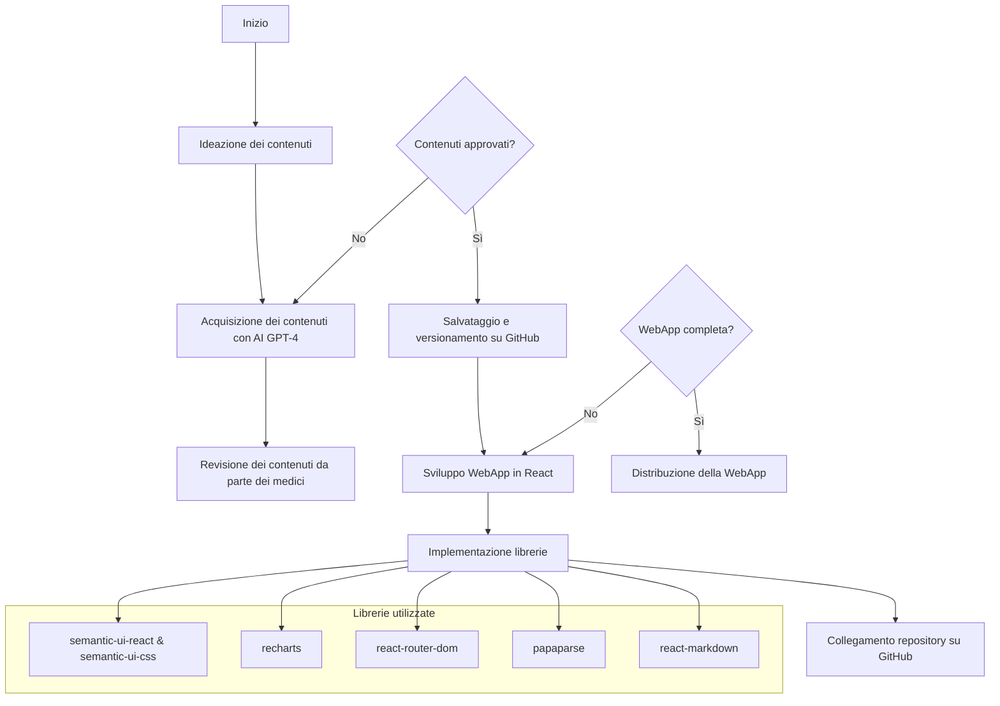
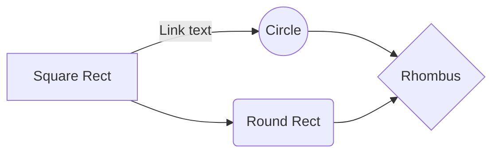
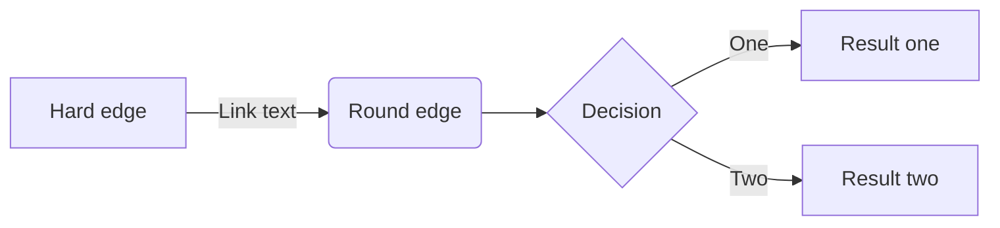

{width=100px height=100px}

# Health Dashboard! Una WebApp per tenere sotto controllo il tuo benessere

[Link alla WebApp (in locale)](http://localhost:5174/)

[Link alla repository del progetto](https://github.com/mauritiuss/health-dashboard)

## Introduzione

Questo progetto è stato sviluppato da un’azienda specializzata nella produzione di dispositivi smart per il monitoraggio della salute, come smartwatch e braccialetti fitness. L’obiettivo è creare un report personalizzato e interattivo, facilmente accessibile, coinvolgente e ricco di informazioni. Questo report permette all’utente di visualizzare in modo chiaro e intuitivo i dati rilevati dal proprio dispositivo smart, come il numero di passi giornalieri, la frequenza cardiaca, le ore di sonno e la temperatura corporea misurata dal polso.

L’azienda richiedeva che il prodotto editoriale digitale fosse di facile comprensione per gli utenti, facilmente accessibile, coinvolgente e informativo. Per soddisfare queste esigenze, è stata scelta la soluzione di una WebApp, in quanto offre numerosi vantaggi: è accessibile da qualsiasi dispositivo con una connessione Internet, non richiede installazione, garantisce aggiornamenti immediati e consente un’esperienza interattiva e dinamica, adattandosi a diverse dimensioni di schermo.

Per l’acquisizione dei contenuti sono state utilizzate intelligenze artificiali, come GPT-4, per reperire documenti scientifici, con integrazioni e revisioni manuali da parte di medici esperti, ove necessario. Il risultato finale risponde pienamente alle richieste dell’azienda, offrendo un accesso semplice e un contenuto interattivo e accurato.

## Ideazione

### Tema
Il tema richiesto dall’azienda riguarda il monitoraggio della salute degli utenti.

Tenere sotto controllo parametri come il numero di passi giornalieri, la frequenza cardiaca, le ore di sonno e la temperatura corporea è fondamentale per mantenere uno stile di vita sano. Tuttavia, questi dati sono spesso difficili da leggere e interpretare. Per questo motivo, la WebApp è stata progettata per presentare le informazioni in modo chiaro e accessibile, attraverso grafici intuitivi e spiegazioni dettagliate dei dati raccolti.

### Destinatari

I seguenti destinatari sono stati creati adottando la tecnica delle personas:

1. **Andrea, 24 anni, studente universitario**
   - **Background**: Studia Ingegneria Informatica, appassionato di tecnologia e dispositivi smart. Fa sport occasionalmente e usa uno smartwatch per monitorare la sua attività fisica.
   - **Obiettivi**: Tenere sotto controllo i suoi parametri vitali e migliorare il proprio stile di vita.
   - **Bisogni**: Dati chiari e facili da consultare, con grafici intuitivi e informazioni dettagliate sui parametri rilevati.
   - **Scenario d'uso**: Accede alla WebApp per controllare i passi giornalieri. Consulta le spiegazioni dei dati per capire come migliorare la sua performance fisica.

2. **Marta, 30 anni, giovane professionista**
   - **Background**: Lavora in smart working come project manager, ha una vita sedentaria e vuole prendersi più cura della propria salute. Ha un fitness tracker per monitorare i suoi parametri.
   - **Obiettivi**: Mantenere uno stile di vita sano nonostante le molte ore passate davanti al computer.
   - **Bisogni**: Un’interfaccia semplice e accessibile per monitorare i dati e controllare le proprie abitudini.
   - **Scenario d'uso**: Consulta la WebApp ogni settimana per verificare i passi fatti, le ore di sonno e la frequenza cardiaca, cercando di migliorare la propria routine.

3. **Luigi, 45 anni, impiegato d’ufficio**
   - **Background**: Lavora a tempo pieno in un’azienda, passa molte ore seduto e ha iniziato a monitorare la sua salute per prevenire problemi cardiovascolari.
   - **Obiettivi**: Tenere sotto controllo i parametri vitali per evitare rischi per la salute.
   - **Bisogni**: Dati facilmente interpretabili e spiegazioni chiare sui valori rilevati, magari con avvisi in caso di anomalie.
   - **Scenario d'uso**: Accede alla WebApp per monitorare la frequenza cardiaca e la temperatura corporea, verificando se i parametri sono nella norma.

4. **Sara, 27 anni, personal trainer**
   - **Background**: Lavora nel settore fitness, usa dispositivi smart per monitorare la propria attività fisica.
   - **Obiettivi**: Avere un quadro chiaro dei dati di attività fisica.
   - **Bisogni**: Grafici dettagliati che aiutino a visualizzare progressi e criticità.
   - **Scenario d'uso**: Accede alla WebApp per monitorare la frequenza cardiaca e la temperatura corporea, verificando se i parametri sono nella norma.

5. **Francesco, 50 anni, paziente con patologie croniche**
   - **Background**: Ha problemi di ipertensione e monitora la propria salute con uno smartwatch medico. È poco esperto di tecnologia.
   - **Obiettivi**: Monitorare parametri come la frequenza cardiaca e la temperatura corporea, evitando situazioni di rischio.
   - **Bisogni**: Interfaccia semplice e spiegazioni chiare sui dati, con indicazioni su quando è necessario consultare un medico.
   - **Scenario d'uso**:  Utilizza la WebApp per controllare i parametri vitali e si sente rassicurato dalla possibilità di accedere facilmente ai suoi dati.

### Modello di fruizione
L’azienda richiede un prodotto editoriale digitale interattivo che crei un report personalizzato, chiaro e coinvolgente. Per soddisfare queste esigenze, è stata scelta una WebApp perché è accessibile da qualsiasi dispositivo con una connessione Internet, senza bisogno di installare programmi aggiuntivi.

Questa soluzione garantisce una fruibilità ottimale su una vasta gamma di dispositivi (smartphone, tablet, PC) e una maggiore adattabilità rispetto a formati statici come PDF o ePub, che possono richiedere applicazioni esterne o non adattarsi perfettamente agli schermi mobili.

Per rendere i dati facili da consultare, abbiamo scelto un modello visivo e interattivo. La WebApp mostra i parametri rilevati (come passi giornalieri, frequenza cardiaca, ore di sonno e temperatura corporea) attraverso grafici chiari e spiegazioni semplici. Questo aiuta l’utente a interpretare facilmente le informazioni sulla propria salute.

L’innovazione di questa WebApp sta nella combinazione di contenuti personalizzati e un’interfaccia interattiva. I dati non solo vengono mostrati, ma anche spiegati con suggerimenti pratici, aiutando l’utente a comprendere meglio il proprio stato di salute. La possibilità di visualizzare grafici dinamici e personalizzare le informazioni rende l’esperienza più coinvolgente e utile.

### Canali di distribuzione
Per distribuire il prodotto editoriale digitale, si prevede l'utilizzo di:

- **Web**: La WebApp sarà il canale principale, accessibile da qualsiasi browser senza bisogno di installare applicazioni aggiuntive.

L’identità visuale seguirà uno stile moderno, chiaro e professionale, con un design minimale che favorisca la leggibilità e l’usabilità. 
Per lo sviluppo grafico, ci siamo affidati a **Semantic UI**, una libreria front-end che offre componenti predefiniti eleganti e facilmente personalizzabili. Questo ha permesso di mantenere una coerenza visiva, con elementi ben strutturati e intuitivi.
Per la rappresentazione dei dati, abbiamo scelto la libreria **Recharts**, che consente di creare grafici dinamici e interattivi (a barre, linee, torte) offrendo una visualizzazione immediata e comprensibile dei parametri monitorati.

Inoltre:
- **Colori**: Palette sobria con tonalità neutre e accenti di colore per evidenziare dati importanti (es.: verde per valori nella norma, rosso per anomalie).
- **Icone**: Anche per le icone, abbiamo utilizzato Semantic UI, garantendo uno stile coerente e riconoscibile in tutta la WebApp.

L’obiettivo è bilanciare innovazione e familiarità:
- **Adesione a modelli conosciuti**: La struttura della WebApp richiama dashboard di monitoraggio già note, facilitando la navigazione intuitiva.
- **Innovazione**: La personalizzazione avanzata dei report e la visualizzazione dinamica dei dati tramite grafici interattivi rendono l’esperienza più coinvolgente rispetto ai report tradizionali statici (come PDF).

## Processo di Produzione

### Acquisizione dei contenuti

L'acquisizione dei contenuti è avvenuta attraverso un approccio misto.

La fase iniziale di generazione del testo e ricerca delle fonti è stata svolta tramite l’intelligenza artificiale, utilizzando **ChatGPT basato sul modello GPT-4**. Questo modello avanzato, sviluppato da OpenAI, è stato scelto per la sua capacità di produrre testi coerenti, pertinenti e ben strutturati.

Successivamente, il contenuto è stato sottoposto a una revisione manuale da parte di esperti medici, con l’obiettivo di garantire un’elevata qualità, integrare eventuali informazioni mancanti e verificare l’accuratezza delle fonti utilizzate.

Quando le fonti originali si sono rivelate insufficienti o poco precise, sono state selezionate ulteriori risorse affidabili per completare il processo di acquisizione dei contenuti in modo rigoroso e attendibile.

Spiegazione del modello adottato:
- **GPT-4**: Si tratta di un modello di linguaggio di ultima generazione sviluppato da OpenAI, noto per la sua capacità di comprendere il contesto e produrre risposte dettagliate e accurate. È stato scelto per la sua particolare efficacia nella generazione di testi complessi, supportando attività come la scrittura creativa, la revisione e l’elaborazione di contenuti tecnici. Questa tecnologia si è rivelata fondamentale nella fase iniziale di raccolta e strutturazione delle informazioni.

L’approccio combinato tra l’utilizzo dell’intelligenza artificiale per il reperimento delle fonti e la revisione da parte di medici esperti ha permesso di offrire agli utenti informazioni accurate, complete e di alto valore.

### Gestione documentale
Il flusso di gestione documentale si compone delle seguenti fasi:
1. **Ideazione**: dentificazione dei contenuti più comuni e significativi in base alle esigenze emerse dalle *personas* definite. Questa fase ha permesso di stabilire quali dati e informazioni sarebbero stati più utili e rilevanti per gli utenti finali.
2. **Acquisizione dei contenuti**: Raccolta delle informazioni tramite intelligenza artificiale, utilizzando **ChatGPT basato sul modello GPT-4**. L’AI è stata impiegata per reperire studi scientifici e dati utili riguardanti i parametri di monitoraggio della salute, come passi giornalieri, frequenza cardiaca, ore di sonno e temperatura corporea.
3. **Revisione dei contenuti**: Le informazioni raccolte tramite l’AI sono state sottoposte a una revisione manuale da parte di medici esperti. Questo passaggio ha garantito l’accuratezza, la coerenza e l’affidabilità dei dati, integrando o correggendo eventuali inesattezze fornite dall’intelligenza artificiale.
4. **Sviluppo della WebApp**: Creazione della WebApp utilizzando **React**. Questa tecnologia è stata scelta per la sua flessibilità, la capacità di creare interfacce dinamiche e l’ampio supporto della community di sviluppatori.
5. **Gestione del versionamento**: Collegamento del repository del progetto a **GitHub**, in modo da gestire in modo efficiente il versionamento del codice e facilitare la collaborazione e il monitoraggio delle modifiche.
6. **Implementazione delle librerie**: Installazione e utilizzo delle librerie necessarie tramite **npm**, per garantire una corretta scrittura del codice e un’interfaccia intuitiva e responsive. Le librerie adottate sono state:
   - **semantic-ui-react** e **semantic-ui-cs** per la progettazione dell’interfaccia grafica.
   - **Vite** per la creazione rapida del progetto React.
   - **papaparse** per la gestione e l’elaborazione dei file CSV.
   - **react-router-dom** per la navigazione tra le diverse pagine della WebApp.
   - **recharts** per la visualizzazione dei dati attraverso grafici chiari e interattivi.
   - **react-markdown** per il rendering della bibliografia in formato markdown.
7. **Salvataggio e aggiornamento**: Ogni modifica e aggiornamento dei contenuti e del codice è stato salvato e versionato tramite GitHub, garantendo una gestione ordinata e tracciabile dello sviluppo del progetto.

### Tecnologie adottate

Descrivere le tecnologie addottate nelle diverse fasi e discuterne il contributo in termini di raggiungimento degli obiettivi descritti negli scenari d'uso.

|                |Scenario 1                          |Scenario 2                       |
|----------------|-------------------------------|-----------------------------|
|Markdown |`'Isn't this fun?'`            |'Isn't this fun?'            |
|XSLT       |`"Isn't this fun?"`            |"Isn't this fun?"            |
|ePud         |`-- is en-dash, --- is em-dash`|-- is en-dash, --- is em-dash|

### Esecuzione del flusso
Allegare, possibilmente attraverso il riferimento ad un repository documentale, i materiali, gli script, le configurazioni, che permettono di riprodurre il flusso di produzione documentale. I contenuti non devono necessariamente essere completi, può essere sufficiente fornire un prototipo per ogni tipologia di contenuto previsto e per ogni formato di destinazione previsto.  

## Valutazione dei risultati raggiunti

### Valutazione del flusso di produzione

Per valutare il contributo proposto valutare le diverse fasi del flusso in termini di (i) riduzione dei tempi di gestione documentale, (ii) riduzione degli errori, (iii) miglioramento della qualità dei documenti, (iv) miglioramento del livello di accettazione della tecnologia, (v) raggiungimento di nuovi canali di distribuzione, (vi) soddisfacimento di nuovi scenari d'uso.
 
### Confronto con lo stato dell'arte

Può anche essere utile confrontare una versione ASIS del flusso di gestione, senza la tecnologia o le innovazioni proposte, e una TOBE che include la tecnologia e le innovazioni proposte dallo studente.

### Limiti emersi

È importante sottolineare i limiti emersi. Come l'impossibilità di accesso ad alcune tecnologie o fasi del flusso di gestione documentale, limiti nella automazione di alcune passi di trasformazione dei formati o di integrazione delle sorgenti

## Conclusioni

Discutere i risultati ottenuti, verificando se gli obiettivi definiti dai casi d'uso siano pienamente o parzialmente raggiunti. Evidenziare gli aspetti nei quali si sono raggiunti i risultati più soddisfacenti e le limitazioni emerse.

## Bibliografia e sitografia

Elencare i riferimenti bibliografici e risorse online che hanno maggiormente contribuito alla realizzazione del progetto. Ad esempio [@sechi2010,@pantieri2021,@ceravolo2023]
